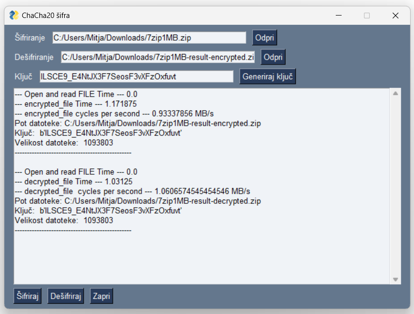

# Implementation of ChaCha20 - Let's a dance

We develop a simple Python application with user interface, where we show the implementation of the ChaCha20 cipher from scratch.

We followed the description of the standardized implementation in [RFC 7539](https://www.rfc-editor.org/rfc/rfc7539).

## Our work

The implementation is in the form of a program that includes the following functionalities:

- entering and opening the file we want to encrypt,
- entering and opening the file we want to decrypt,
- encrypting and decrypting any file with a chosen key entered by the user or generated with button (what the 'key' is depends on the cipher).

